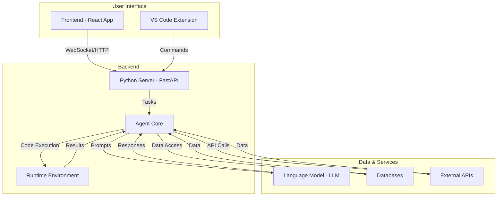
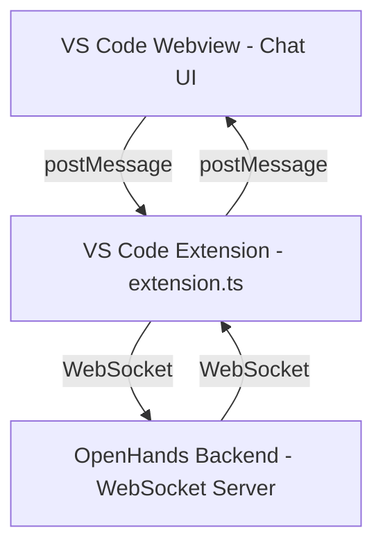

# OpenHands Codebase Analysis

This document provides a comprehensive analysis of the OpenHands codebase, including its architecture, development guidelines, and suggestions for future enhancements.

## 1. Code Architecture

The OpenHands project is a sophisticated, multi-component system designed to provide an AI-powered software development environment. The architecture can be broken down into three main parts:

*   **Backend (`openhands`):** A Python-based core that houses the AI agent, server, and business logic.
*   **Frontend (`frontend`):** A React-based web application that provides the user interface.
*   **VS Code Extension (`openhands/integrations/vscode`):** A TypeScript-based extension for integrating OpenHands with Visual Studio Code.

### High-Level Architecture Diagram



## 2. Design Architecture

### Backend Design

The backend follows an event-driven architecture, which is well-suited for handling asynchronous tasks and long-running processes. The key components are:

*   **`LLM`:** An abstraction layer for interacting with various language models.
*   **`Agent`:** The core AI agent responsible for decision-making and task execution.
*   **`AgentController`:** Manages the agent's state and orchestrates the execution of tasks.
*   **`EventStream`:** A central message bus for communication between different components.
*   **`Runtime`:** A sandboxed environment for executing code and commands.
*   **`Server`:** A FastAPI server that exposes the backend's functionality via a RESTful API and WebSockets.

### Frontend Design

The frontend is a modern single-page application (SPA) built with React and Remix. It uses Redux for state management and Tailwind CSS for styling. The application is designed to be modular and extensible, with a clear separation of concerns between components, services, and state.

## 3. Development Guideline

### Getting Started

1.  **Prerequisites:** Ensure you have Python 3.12, Node.js 22.x, Poetry, and Docker installed.
2.  **Installation:** Run `make build` from the root directory to install all dependencies.
3.  **Configuration:** Run `make setup-config` to configure your language model and API keys.
4.  **Running the Application:** Use `make run` to start both the backend and frontend servers.

### Contribution Guidelines

*   **Branching:** Create a new branch for each feature or bug fix.
*   **Commits:** Follow the Conventional Commits specification for commit messages.
*   **Pull Requests:** Submit a pull request with a clear description of your changes. Ensure all tests pass before submitting.
*   **Code Style:** Follow the existing code style. Use `ruff` for Python and `prettier` for TypeScript.

## 4. Additional Feature Development Guidelines

### Adding a New Agent

1.  Create a new directory in `openhands/agenthub`.
2.  Implement the `Agent` class, defining the agent's behavior and prompts.
3.  Register the new agent in the agent hub.

### Adding a New Runtime

1.  Implement the `Runtime` interface defined in `openhands/runtime/base.py`.
2.  Add the necessary configuration options to `config.toml`.
3.  Register the new runtime in the runtime factory.

## 5. Relationships between files and folders

*   **`openhands/`**: The core of the application, containing the backend logic.
    *   **`agenthub/`**: Home to different specialized agents that can be used to perform tasks.
    *   **`controller/`**: Manages the agent's lifecycle and state.
    *   **`llm/`**: Handles communication with Large Language Models.
    *   **`runtime/`**: Provides the sandboxed environment for code execution.
    *   **`server/`**: The FastAPI application that serves the backend API.
*   **`frontend/`**: The user-facing web application.
    *   **`src/`**: Contains the source code for the React application.
    *   **`components/`**: Reusable React components.
    *   **`state/`**: Redux store, actions, and reducers.
*   **`integrations/`**: Connectors to third-party services.
    *   **`vscode/`**: The source code for the VS Code extension.

## 6. How to implement chat ui to openhands/integrations/vscode extension

The current VS Code extension primarily focuses on launching the OpenHands agent in a terminal. To implement a chat UI, you would need to use VS Code's Webview API.

### Steps to Implement a Chat UI

1.  **Create a Webview:** In `extension.ts`, create a new command that opens a Webview panel. This will be the container for your chat UI.

    ```typescript
    // In extension.ts
    const panel = vscode.window.createWebviewPanel(
      'chatPanel', // Identifies the type of the webview. Used internally
      'OpenHands Chat', // Title of the panel displayed to the user
      vscode.ViewColumn.One, // Editor column to show the new webview panel in.
      {
        enableScripts: true // Enable scripts in the webview
      }
    );
    ```

2.  **Build the Chat UI:** The chat UI itself will be an HTML page with CSS and JavaScript. You can use a simple framework like Preact or even plain HTML/CSS/JS for this. The HTML for the webview can be loaded from a file.

    ```typescript
    // In extension.ts
    panel.webview.html = getWebviewContent();

    function getWebviewContent() {
      // Return the HTML content for the chat UI
    }
    ```

3.  **Communication between Extension and Webview:** You'll need to establish a two-way communication channel between your extension's main process and the Webview.

    *   **From Extension to Webview:** Use `panel.webview.postMessage()` to send messages to the Webview.
    *   **From Webview to Extension:** In the Webview's JavaScript, use `vscode.postMessage()` to send messages back to the extension.

4.  **Integrate with the Backend:** The extension will need to communicate with the OpenHands backend via WebSockets. You can use a library like `ws` for this. The extension will act as a bridge between the Webview and the backend.

### Architecture Diagram for Chat UI



## 7. How to enhance openhands/integrations/vscode

Beyond a chat UI, there are several ways to enhance the VS Code extension:

*   **Inline Code Suggestions:** Use the Inline Completion Provider API to suggest code changes directly in the editor.
*   **Code Actions:** Provide Code Actions (lightbulb suggestions) for common tasks, such as refactoring code or adding docstrings.
*   **Custom Editors:** For a more integrated experience, you could create a custom editor for interacting with the agent.
*   **Sidebar View:** Add a sidebar view to display the agent's status, history, and other information.
*   **Deeper Integration with the Debugger:** Integrate with the VS Code debugger to allow the agent to step through code and inspect variables.
*   **File System Integration:** Allow the agent to directly read and write files in the workspace, with the user's permission.
*   **Enhanced Terminal Integration:** Improve the existing terminal integration with features like command history and better error handling.
*   **Settings UI:** Add a settings UI to allow users to configure the extension without editing `settings.json` directly.

## 8. Integrating with `continue.dev`

This section provides a guide on how to integrate the `continue` VS Code extension with the OpenHands backend, using the `continue` UI as a frontend for the OpenHands agent.

### 1. The Bridge Server

The integration is achieved through a "bridge" server that translates between the `continue` extension and the OpenHands backend. The code for the bridge server is in `bridge_server.py`.

### 2. Running the Integrated Setup

To run the integrated setup, you need to have three components running:

1.  **The OpenHands Backend:**
    Start the OpenHands backend as usual:
    ```bash
    make start-backend
    ```

2.  **The Bridge Server:**
    In a separate terminal, start the bridge server:
    ```bash
    python bridge_server.py
    ```
    The bridge server will run on `http://localhost:8001`.

3.  **The `continue` VS Code Extension:**
    *   Install the [`continue`](https://marketplace.visualstudio.com/items?itemName=Continue.continue) extension from the VS Code Marketplace.
    *   Open your `config.json` file for `continue`. You can do this by opening the command palette (`Ctrl+Shift+P`), typing `> Continue: Edit config.json`, and pressing Enter.
    *   Add the following to your `config.json` to configure the OpenHands agent as a custom model:

    ```json
    {
      "models": [
        {
          "title": "OpenHands Agent",
          "provider": "openai",
          "model": "openhands-agent",
          "apiBase": "http://localhost:8001/v1"
        }
      ]
    }
    ```
    *   Reload VS Code to apply the changes.

### 3. Using the Integrated Setup

Once all three components are running, you can open the `continue` chat view in VS Code and select the "OpenHands Agent" model. You can then start a conversation with the OpenHands agent through the `continue` UI.

#### 4. Streaming Responses

The bridge server now supports streaming responses. This means that you will see the agent's thoughts and actions in real-time in the `continue` chat UI, which provides a much better user experience.

To enable streaming, make sure that the `stream` parameter is set to `true` in your `continue` configuration. This is usually the default.
